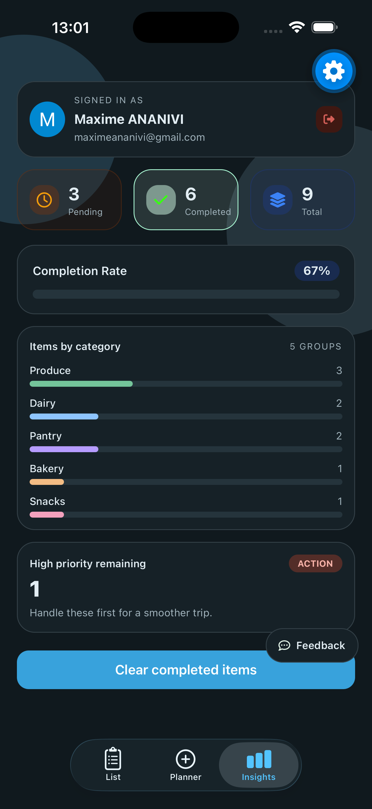

<div align="center">
    
    <h1>🛒 Application Mobile Full-Stack de Liste de Courses 🛒</h1>
    <p>
        <strong>Grocify</strong> est une application de liste de courses conçue pour simplifier l'organisation et la gestion de vos achats.
        Construite avec <strong>Expo</strong>, <strong>Clerk</strong> et <strong>PostgreSQL (Neon)</strong>, elle permet de <strong>planifier vos courses</strong>, <strong>gérer vos articles</strong> et <strong>analyser votre taux de complétion</strong> grâce à des résumés clairs et automatisés.
    </p>
</div>

---

## 📸 Screenshots

<p align="center">
  
  &nbsp;&nbsp;
  
  &nbsp;&nbsp;
  
  &nbsp;&nbsp;
  
</p>

---

✨ **Points forts :**

- 📱 Application mobile entièrement fonctionnelle développée avec React Native et Expo
- 🧑‍💻 Accessible aux débutants
- 📱 Support multiplateforme (iOS et Android)
- 🔐 Authentification avec Clerk (connexion via Google, Apple et GitHub)
- 🧾 Écran de liste pour gérer les articles de courses
- ✅ Marquage des articles comme achetés avec une fonctionnalité de coche
- 🔢 Mise à jour des quantités d'articles
- 🗑️ Suppression d'articles
- 📝 Écran de planification pour ajouter de nouveaux articles de courses
- 📊 Écran d'aperçu avec les informations du profil et des statistiques
- 🚪 Processus de déconnexion sécurisé
- 🧹 Suppression des articles terminés en un seul bouton
- 💬 Bouton de retour utilisateur pour recueillir les suggestions de fonctionnalités et les signalements de bugs
- 🎨 Effet d'onglet iOS "Liquid Glass" utilisant Expo Native Tabs
- 🗄️ Base de données PostgreSQL pour le stockage persistant des données
- 🧩 Drizzle ORM pour des requêtes de base de données typées et sécurisées
- ☁️ Hébergement de la base de données dans le cloud avec Neon
- 🎨 Stylisation avec NativeWind (TailwindCSS pour React Native)
- ⚡ Gestion de l'état global avec Zustand
- 🚀 Architecture mobile Full-Stack moderne
- 🆓 Configuration 100 % gratuite — Aucune carte de crédit requise
- 📂 Code source complet fourni

---

# 🧪 Configuration du fichier `.env`

Créez un fichier `.env` à la **racine du projet** et ajoutez les variables suivantes :

```bash
DATABASE_URL=votre_url_de_base_de_donnees

EXPO_PUBLIC_CLERK_PUBLISHABLE_KEY=votre_cle_publique_clerk

EXPO_PUBLIC_SENTRY_DSN=votre_dsn_sentry
SENTRY_AUTH_TOKEN=votre_token_d_authentification_sentry
```

## 🔧 Lancer l'application

```bash
npm install
npx expo run:ios or npx expo run:android
```
